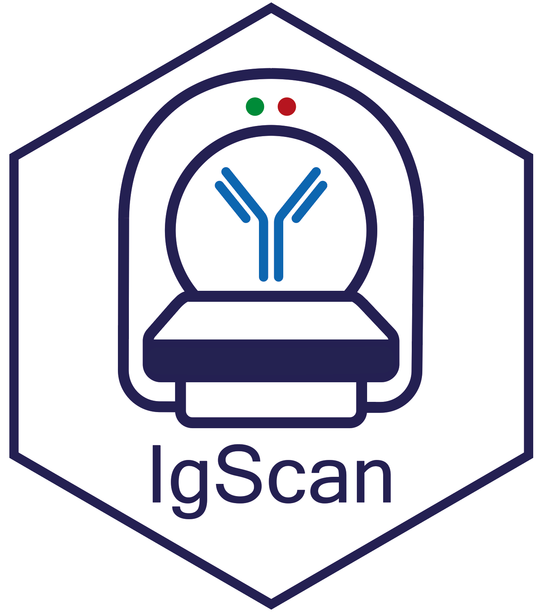
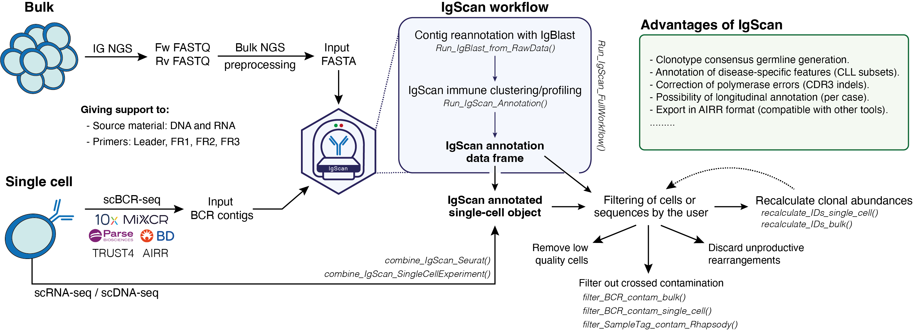

<!-- README.md is generated from README.Rmd. Please edit that file -->

# IgScan

## A high-throughput analysis toolkit for dissecting immune repertoires in B-cell neoplasms and beyond



### Introduction

The analysis of the immune repertoire has become one of the cornerstones
in basic and clinical research in B-cell neoplasms over the past few
years. Understanding the diversity and clonality of B-cell receptors is
critical for unraveling disease mechanisms, tracking minimal residual
disease, and guiding therapeutic strategies. In this context, the
emergence of next-generation sequencing technologies, both at bulk and
single-cell levels, has revolutionized our ability to characterize
B-cell receptor repertoires with unprecedented depth and resolution, as
well as to integrate BCR profiling with multiple omic layers.

Although several tools have been developed to analyze immune repertoire
data, many are either optimized for T-cell receptors, lack flexibility
for custom analyses, or are not tailored to the specific features of
B-cell neoplasms. This limits their applicability in studies where
disease-specific patterns, such as somatic hypermutation or clonal
evolution, play a central role.

IgScan is designed to fill this gap by providing a streamlined,
customizable, and reproducible framework focused on the immune profiling
of B-cell malignancies. It is compatible with both bulk and single-cell
sequencing data, and supports a wide range of common input formats,
including 10x Genomics, MiXCR, TRUST4, Parse Evercode, BD Rhapsody, and
AIRR, among others.

Although originally designed with a focus on B-cell malignancies, IgScan
is also well suited for broader BCR repertoire analyses, such as
studying BCR diversity in healthy individuals. Additionally, it can be
seamlessly integrated with other tools for somatic hypermutation
analysis and BCR phylogenetic reconstruction
*([Dowser](https://dowser.readthedocs.io/en/latest/))*, enabling
comprehensive immune repertoire studies across a wide range of
biological contexts.



## Working with IgScan

The [IgScan website](https://nadeulab.github.io/IgScan/) provides
extensive documentation and step-by-step tutorials for all core
functions.

## Installation

### Installing from GitHub

The current version of IgScan can be downloaded from this GitHub
repository by:

``` r
install.packages("devtools")
library(devtools)

devtools::install_github("https://github.com/nadeulab/IgScan/tree/main",
                         build_vignettes = T, dependencies = T)
```

## IgScan example datasets

Example datasets for testing IgScan can be accessed by the users once
the package has been built/installed. Our example datasets consists of:

### Preprocessed fasta files for bulk NGS

``` r
fasta_ngs_1 <- system.file("extdata/igscan_test_bulkNGS_sample1.fasta", package = "IgScan", mustWork = T)

fasta_ngs_2 <- system.file("extdata/igscan_test_bulkNGS_sample2.fasta", package = "IgScan", mustWork = T)
```

### Seurat objects and filtered_contig fasta files for single cell (10x)

``` r
fasta_sc_1 <- system.file("extdata/igscan_test_10xBCR_sample1.fasta", package = "IgScan", mustWork = T)
seurat_1 <- system.file("extdata/igscan_test_10xSeurat_sample1.rds", package = "IgScan", mustWork = T)

fasta_sc_2 <- system.file("extdata/igscan_test_10xBCR_sample2.fasta", package = "IgScan", mustWork = T)
seurat_2 <- system.file("extdata/igscan_test_10xSeurat_sample2.rds", package = "IgScan", mustWork = T)
```

## Suggest updates / Report Bugs

To suggest improvements, modifications or request additional
functionalities for IgScan, please, submit them as [GitHub
issues](https://github.com/nadeulab/IgScan/issues).

If running into any bugs or issues also submit a [GitHub
issue](https://github.com/nadeulab/IgScan/issues) with some details of
the problem. Submitting a [reproducible
example](https://reprex.tidyverse.org/) would be of help.

We are also open for [pull
requests](https://github.com/nadeulab/IgScan/pulls) for fixing bugs or
add new features.

## Please Cite

If you use this package in published work, please cite the GitHub
repository for now:

<https://github.com/nadeulab/IgScan>

A manuscript describing the method is currently in preparation and
citation details will be updated once available.
