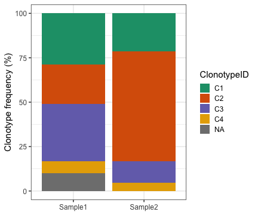
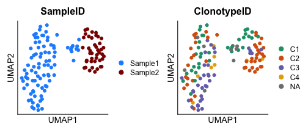
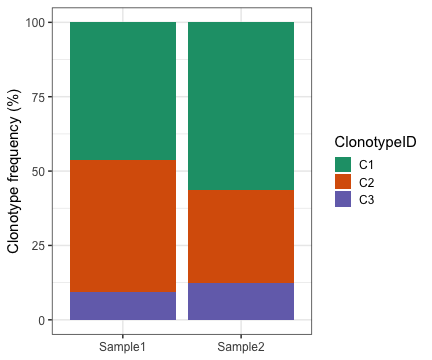

``` r
library(IgScan)
library(Seurat)
library(ggplot2)
library(dplyr)

outputDir <- tempfile("igscan_vignette_")
dir.create(outputDir)
```


``` r
if (!nzchar(system.file(package = "IgScan"))) {
  pkg_path <- function(...) file.path("../../inst", ...)
} else {
  pkg_path <- function(...) system.file(..., package = "IgScan")
}
```

# Introduction

The IgScan single-cell workflow processes B cell receptor (BCR) contigs from a variety of single-cell technologies (see next section for details).

In this workflow, IG contigs are re-annotated with the [**IgBlast tool**](https://www.ncbi.nlm.nih.gov/igblast/index.cgi) [Ye et al., *Nucleic Acids Res*, 2013] using the [**IMGT database**](https://www.imgt.org/), and are immunogenetically characterized both at the contig level (individual chains) and the cell level (paired heavy and light chains).

The annotations produced by IgScan can be integrated with mRNA expression data stored in **Seurat** or **SingleCellExperiment** formats, enabling multimodal analysis.

Finally, IgScan provides a set of functions to help users fully leverage their single-cell BCR-seq data and enables exporting the results in the consensus AIRR format for the interaction with other packages such as [*Dowser*](https://dowser.readthedocs.io/en/latest/) or [*scRepertoire*](https://www.borch.dev/uploads/screpertoire/) among others.

## Supported input data formats

IgScan supports several input data formats from different single-cell technologies. Currently, the following formats are supported:

- [10X Genomics CellRanger](https://www.10xgenomics.com/software): filtered contig outputs (both *.fasta* and *.csv* formats)

- [BD Rhapsody](https://www.bd-rhapsody.com/) Multiomic Immune Profiling

- [Parse](https://www.parsebiosciences.com/) Evercode BCR

- [MiXCR](https://mixcr.com/)

- AIRR / IMGT AIRR

- Raw fasta file

# Running IgScan single cell workflow

The IgScan annotation workflow is divided in three different steps:

1.  **IgBlast re-annotation**
2.  **IgScan immunogenetic characterization**
3.  **Combination of IgScan outputs with single-cell objects**

In order to show the different functionalities of IgScan, here we will run these two steps in a step-wise manner, although the complete workflow is wrapped in the `IgScan::Run_IgScan_FullWorkflow()` function, which takes the same arguments.

Here we show an example of how IgScan works in a 10x Genomics demo dataset:

## Step 1. IgBlast contig re-annotation

This first part of the workflow can be executed by the `IgScan::Run_IgBlast_from_RawData()` function. This function checks and loads the input contigs and writes a fasta file that will be passed as input to the IgBlast tool.

After that, if `run_IgBlast_report = TRUE`, an exploratory data analysis of IgBlast outputs is performed and a report in PDF format is generated in the `outputDir`, which can be of interest when the level of clonality of the samples is unknown. The information obtained from the report can be used by the user to adjust some parameters in the following step (i.e. `hc_similarity_cutoff` based on the distribution of CDR3 length or `cdr3_InDel_correction_mode` if the samples are highly polyclonal).


``` r
s1 <- pkg_path("extdata/igscan_test_10xBCR_sample1.fasta")
s2 <- pkg_path("extdata/igscan_test_10xBCR_sample2.fasta")

IgScan::Run_IgBlast_from_RawData(
  sample_paths = c(s1, s2), 
  sample_labels = c("Sample1", "Sample2"), 
  input_format = "10xbcr_fasta", 
  data_type = "single_cell", 
  annotate_C = TRUE, 
  outputDir = paste0(outputDir, "IGSCAN_VIGNETTE_SC/"), ## Change by your own outputDir
  run_IgBlast_report = TRUE)
```

Once this step is completed, the `outputDir` is created (if it did not exist before running the command) and contains the subdirectories `fasta_inputs` and `igblast_outs`. If the function has run correctly, the `igblast_outs` directory should contain three different files per sample:

- **\*igblast_out.tsv file**: containing the re-annotation for each contig in the `fasta_inputs`.

- **\*IgBlast_report.txt** / **\*IgBlast_report.pdf**: containing the summary report of the IgBlast outputs.

The IgBlast report file can give the user important information about the quality of the data (by looking at the IgBlast alignment scores) and the level of BCR clonality. To learn how to interpret the IgBlast report file see the vingette [**Interpret IgBlast report file**](interpret_IgBlast_report.html).

## Step 2. IgScan immunogenetic characterization

Now that IgBlast outputs have been generated, they will be used as input for the next step of the IgScan workflow, which can be executed by the `IgScan::Run_IgScan_Annotation()` function. This function will take the contig re-annotation and return a list of IgScan dataframes with the immunogenetic characterization of each sample.

For this part of the workflow, it is important to choose if the analysis is performed in 'single' or 'joint' `analysis_mode`. When analyzing related samples, such samples from the same individual, in which it is plausible that the same clonotype is identified in both samples, the 'joint' mode performs a consensus annotation across samples in order to longitudinally track clonotypes.


``` r
igscan_out <- IgScan::Run_IgScan_Annotation(
  sample_labels = c("Sample1", "Sample2"),
  case_labels = c("CaseA", "CaseA"),
  outputDir = paste0(outputDir, "IGSCAN_VIGNETTE_SC/"), 
  input_format = "10xbcr_fasta", 
  analysis_mode = "joint",
  data_type = "single_cell",
  material_type = "rna",
  v_primer = "full_length", 
  remove_tmp = FALSE, 
  hc_similarity_cutoff = 0.2, 
  hc_mode = "average", 
  cdr3_mode = "nt", 
  cdr3_InDel_correction_mode = "soft_filter")
```

## Step 3. Combining the IgScan output with a single cell object

When the IgScan annotation workflow has been completed, it is typical to combine the immunogenetic annotation of each cell barcode with the single cell object containing the gene expression data. To that aim, the IgScan package supports the merge of both Seurat (`IgScan::combine_IgScan_Seurat`) and SingleCellExperiment (`IgScan::combine_IgScan_SingleCellExperiment`) objects with the IgScan outputs.

**IMPORTANT:** these functions rely on the exact match of the barcodes between the IgScan outputs and the single cell objects. Please, ensure that there have not been modifications in the barcode IDs during data processing both in the IgScan outputs and the single cell objects.

The IgScan annotation data is appended to the meta.data/colData of the single cell object, and the match is performed by sample. This means that if the single cell object contains several samples (and thus, possible repeated barcodes), the IgScan output will be evaluated per barcode within each sample identifier. If this is the case, it is important that the sample ID also match between IgScan outputs and single cell objects.

In this vingette, we will load two Seurat objects belonging to samples `Sample1` and `Sample2` and we will combine them with their corresponding IgScan output.


``` r
o1 <- pkg_path("extdata/igscan_test_10xSeurat_sample1.rds")
o2 <- pkg_path("extdata/igscan_test_10xSeurat_sample2.rds")

seurat_1 <- readRDS(o1)
seurat_2 <- readRDS(o2)

seurat_1 <- IgScan::combine_IgScan_Seurat(igscan_out = igscan_out$Sample1_annot, 
                                          seurat_object = seurat_1)

seurat_2 <- IgScan::combine_IgScan_Seurat(igscan_out = igscan_out$Sample2_annot, 
                                          seurat_object = seurat_2)
```

You can now visualize the meta.data of the two Seurat objects and see how the IgScan annotation of each cell has been appended. To learn how to interpret the IgBlast report file see the [Interpret IgBlast report file](interpret_IgBlast_report.html) vingette.

**Note:** this step could have been performed in a different way if the Seurat objects had been merged together. If this is the case, the IgScan outputs should be concatenated, for instace by `do.call(rbind, igscan_out)`, and then the user should run:

``` IgScan::combine_IgScan_Seurat``(igscan_out =``do.call(rbind, igscan_out)``, seurat_object = seurat_merged, seurat_sample_col = "orig.ident", igscan_sample_col = "SampleID") ```.

# Downstream analyses in IgScan single cell workflow

## Exploratory data analyses


``` r
color <- c("C1" = "#1B9E77", "C2" = "#D95F09", "C3" = "#7570B9", "C4" = "#E6AB02")
```

Now that we have the Seurat objects with IgScan annotation, we can now evaluate the BCR repertoire in the samples analyzed. First of all, we can rapidly visualize the distribution of clonotypes in a barplot.


``` r
seurat_merge <- merge(seurat_1, seurat_2)

clonotype_df <- seurat_merge@meta.data %>%
  group_by(orig.ident, igClonotypeID_num) %>%
  summarise(count = n(), .groups = "drop") %>%
  group_by(orig.ident) %>%
  mutate(freq_rel = count / sum(count)*100)

freq_plt <- ggplot(clonotype_df, aes(x = orig.ident, y = freq_rel, fill = igClonotypeID_num)) +
  geom_bar(stat = "identity", position = "stack") +
  scale_fill_manual(values = color) + theme_bw(base_size = 15) +
  labs(x = NULL, y = "Clonotype frequency (%)", fill = "ClonotypeID")

freq_plt
```

<div class="figure" style="text-align: center">

<p class="caption">plot of chunk igscan_anal_1</p>
</div>

The barplot reveals clonal dynamics between the two samples, with a remarkable increase of clonotype 2 (C2) in Sample2 compared to Sample1. Now, these cells can be visualized in a UMAP representation colored by BCR clonotype.


``` r
seurat_merge <- JoinLayers(seurat_merge)
seurat_merge <- NormalizeData(object = seurat_merge, verbose = F)
seurat_merge <- FindVariableFeatures(object = seurat_merge, verbose = F)
seurat_merge <- ScaleData(object = seurat_merge, verbose = F)
seurat_merge <- RunPCA(object = seurat_merge, verbose = F)
seurat_merge <- FindNeighbors(object = seurat_merge, dims = 1:30, verbose = F)
seurat_merge <- FindClusters(object = seurat_merge, resolution = 1, verbose = F)
seurat_merge <- RunUMAP(object = seurat_merge, dims = 1:30, verbose = F)

sam_dim <- DimPlot(seurat_merge, group.by = "orig.ident",
                   cols = c("dodgerblue", "darkred"), pt.size = 2) +
  theme(axis.text = element_blank(), axis.ticks = element_blank()) +
  labs(x = "UMAP1", y = "UMAP2") + ggtitle("SampleID")

clone_dim <- DimPlot(seurat_merge, group.by = "igClonotypeID_num",
                     cols = color, pt.size = 2) +
  theme(axis.text = element_blank(), axis.ticks = element_blank()) +
  labs(x = "UMAP1", y = "UMAP2") + ggtitle("ClonotypeID")
```


``` r
print(sam_dim + clone_dim)
```

<div class="figure" style="text-align: center">

<p class="caption">plot of chunk igscan_anal_3</p>
</div>

## Auxiliar IgScan functions

### Identification of BCR-based doublets

As it can be observed in the barplot and the UMAPs, there are some cells in this merged object that lack information in the `igClonotypeID_num` field. The explanation for this is found in the `completeBCR` field (see the [Uderstand IgScan output format](understand_IgScan_output.html) vingette for more information).


``` r
table(seurat_merge$igClonotypeID_num, seurat_merge$completeBCR, useNA = "ifany")
```

```
##       
##        Alternative_clonotype Clonotype_doublet Single_chain_1 Yes
##   C1                      11                 0              0  24
##   C2                       0                 0              0  46
##   C3                       0                 0              0  34
##   C4                       0                 0              0   8
##   <NA>                     0                 1              8   0
```

Here it can bee appreciated that the NAs are caused by `Clonotype_doublet`, `Repeated_chain` and `Single_chain_1` cells. From the IgScan development team, we recommend removing the first two categories from the single cell objects, since they are suggestive of remaining doublets in the data.


``` r
seurat_merge <- subset(seurat_merge, 
                       subset = !completeBCR %in% c("Clonotype_doublet", "Repeated_chain"))
```

### Re-assignment of cells with incomplete BCR

On the `Single_chain_1` and `Single_chain_2` categories, IgScan offers the possibility to reassign these cells in which only one rearrangement has been detected to the most plaussible clonotype based on the match between the detected chain and the chains from `completeBCR=Yes` cells. To do so, the function `IgScan::rescue_single_chain_cells` can be run.

This function requires a grouping variable that indicates which samples can be used to find "matchable" clonotypes. In addition, after the clones being rescued, clonotype identifiers are automatically realculated in order to avoid, for instance, C2 having more cells than C1 in the case that a lot of single-chain cells were re-assigned to C2.

In this example, samples come from the same individual, so it is recommended to run the `rescue_single_chain_cells` function **by case** (so that the joint annotation is not undone).


``` r
seurat_merge$case <- "Case1"
seurat_merge <- IgScan::rescue_single_chain_cells(single_cell_object = seurat_merge, 
                                                  group_col = "case")
```

Now, we can run the same `table()` command that we run before to check how these fields have changed.


``` r
table(seurat_merge$igClonotypeID_num, seurat_merge$completeBCR, useNA = "ifany")
```

```
##     
##      Alternative_clonotype Yes Yes_rescue
##   C1                     0  46          4
##   C2                    11  24          4
##   C3                     0  34          0
##   C4                     0   8          0
```

This output shows that the 8 `Single_chain_1` cells have been "rescued" and re-assigned to previously detected clonotypes. Note that the `completeBCR` field in these cells has been labeled as `Yes_rescue`. In order to explain what has happened, let's look at cell ACAGCTACAGCCTGTG-1.

The rearrangement found in this cell was IGKV1D-12_CQQANSFPPTF, which matches perfectly and uniquely with one of from clonotype 1 (C1), which is defined by IGHV1-69_CAREKGSVSWIQLWAYFDYW and IGKV1D-12_CQQANSFPPTF heavy and light chains. Thus, the re-assignment is allowed by the function and is included in the object meta.data.

### Recalculation of clonotype IDs when filtering cells from the object

Imagine that we have been told that clonotype 1 (C1) in our data comes from the crossed contamination of these samples with another sample from a different individual. In this scenario, it would be reasonable to remove C1 from the single cell object.


``` r
seurat_merge_filter <- subset(seurat_merge, subset = igClonotypeID_num != "C1")
table(seurat_merge_filter$igClonotypeID_num, seurat_merge_filter$orig.ident)
```

```
##     
##      Sample1 Sample2
##   C2      30       9
##   C3      29       5
##   C4       6       2
```

After removing C1, these clonotype identifiers do not make sense anymore, they need to be recalculated. In order to do so, IgScan enables clonotype ID recalculation in single cell objects by the function `IgScan::recalculate_IDs_single_cell`, which can be useful when some cells are filtered from the dataset.

This function requires a grouping variable that indicates how IDs need to be recalculated. Since the annotation of these samples has been performed by case (and remember that clones are differently distributed across samples), clonotype IDs should not be recalculated by sample, otherwise the joint annotation is not undone, but by case.


``` r
seurat_merge_filter <- recalculate_IDs_single_cell(single_cell_object = seurat_merge_filter,
                                                   group_col = "case")
table(seurat_merge_filter$igClonotypeID_num, seurat_merge_filter$orig.ident)
```

```
##     
##      Sample1 Sample2
##   C1      30       9
##   C2      29       5
##   C3       6       2
```

You can now appreciate that clonotype IDs follow a comprehensive order and the clonotype distribution is shown in the following barplot.


``` r
clonotype_df2 <- seurat_merge_filter@meta.data %>%
  group_by(orig.ident, igClonotypeID_num) %>% 
  summarise(count = n(), .groups = "drop") %>% 
  group_by(orig.ident) %>% 
  mutate(freq_rel = count / sum(count)*100)

freq_plt2 <- ggplot(clonotype_df2, 
                   aes(x = orig.ident, y = freq_rel, fill = igClonotypeID_num)) + 
  geom_bar(stat = "identity", position = "stack") + 
  scale_fill_manual(values = color) + theme_bw(base_size = 15) + 
  labs(x = NULL, y = "Clonotype frequency (%)", fill = "ClonotypeID")

freq_plt2
```

<div class="figure" style="text-align: center">

<p class="caption">plot of chunk igscan_anal_10</p>
</div>
