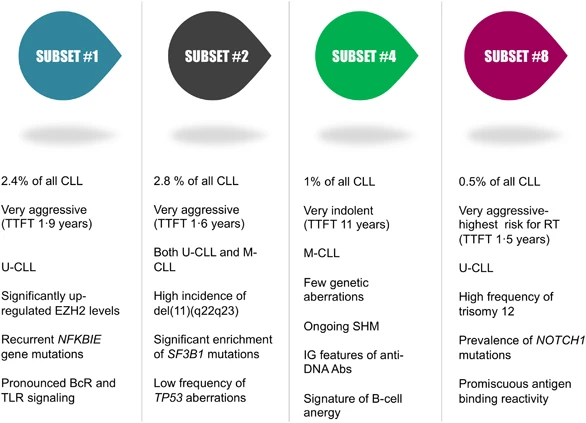
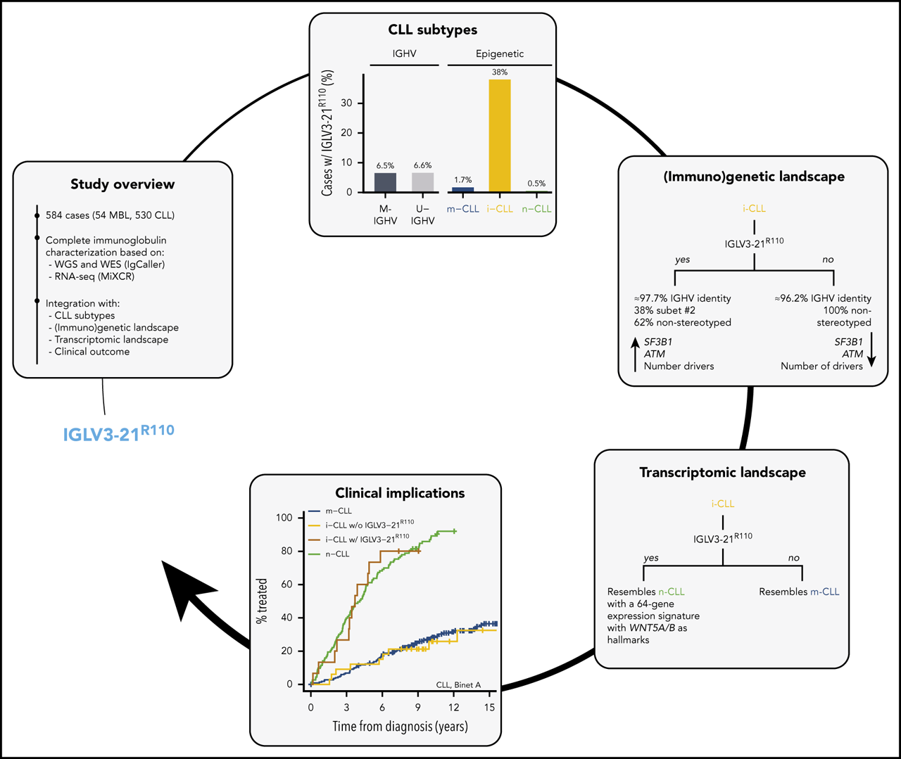
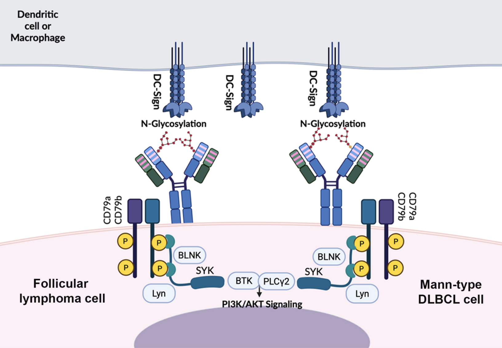

```{r, echo=FALSE}
options(rmarkdown.html_vignette.check_title = FALSE)
```

Immunogenetic characterization of B-cell receptors (BCRs) in lymphoid malignancies provides critical insights into disease biology, patient stratification, and therapeutic targeting. While most tools for the analyses of immune repertoires focus on general annotation (VDJ usage, CDR3 definition, clonotype assignment, etc.), the real clinical impact emerges when **tumor-specific immunogenetic features** are identified.

In this regard, IgScan is designed to bridge this gap by automatically annotating such features, enabling both bulk and single-cell NGS data analyses to capture disease-relevant immunogenetic signals that have been well established in B-cell neoplasms community.

The current release of IgScan supports the annotation of relevant biomarkers in chronic lymphocytic leukemia (**CLL**), including CLL stereotyped subsets and the IGLV3-21^R110^ mutation, as well as the detection of acquired N-glycosylation sites (AGS), originally described in follicular lymphoma (**FL**) and more recently reported in diffuse large B-cell lymphoma (**DLBCL**).

As IgScan developers, we are committed to expanding its scope to other relevant immunogenetic features in B-cell malignancies, as well as newly discovered biomarkers, which may be incorporated in upcoming releases of the package.

### CLL stereotyped subsets

In CLL, approximately 40% of cases harbor **stereotyped BCRs**, defined by highly similar V gene usage, somatic hypermutation status, and CDR3 motifs across unrelated patients. Among these stereotyped BCRs, \~13% are grouped into what are called **major stereotyped subsets**, representing a significant fraction of CLL patients. These subsets are considered evidence of antigen-driven selection and are strongly associated with distinct clinical and biological profiles [[Agathangelidis et al., 2021](https://ashpublications.org/blood/article/137/10/1365/463992/Higher-order-connections-between-stereotyped)].

IgScan enables the user to annotate major CLL stereotyped subsets in bulk and single-cell datasets, thus making this layer of annotation accessible in high-throughput analyses. To do so, the user must set the argument `annotate_CLL_immGen=TRUE` when running IgScan.

```{r, out.width="70%", fig.align='center', echo=FALSE}

```

::: {style="text-align: center;"}
<p>~Figure from Stamatopoulos *et al., Leukemia* (2016).~</p>
:::

In addition to major CLL subsets, IgScan also enables the annotation of **satellite stereotyped subsets**, which are more relaxed definitions of stereotypy and indicate that a given sequence closely resembles a major subset [Agathangelidis et al., 2012]. To do so, the user must set the argument `annotate_satellite_subsets=TRUE` when running IgScan.

### IGLV3-21^R110^ mutation

A paradigm-shifting discovery in CLL immunogenetics has been the recognition of the **IGLV3-21^R110^ mutation**, a recurrent replacement of glycine with arginine at position 110 of the immunogloublin of cases expressing the IGLV3-21 light chain gene. This single amino acid substitution is associated with an aggressive clinical course and defines a distinct, clinically relevant CLL entity, independent of IGHV mutational status [[Nadeu *et al.*, 2021](https://ashpublications.org/blood/article/137/21/2935/474211/IGLV3-21R110-identifies-an-aggressive-biological)].

By annotating the presence of this mutation, IgScan enables the precise identification of cases carrying this poor-prognostic biomarker, which has now been incorporated into the modern immunogenetic classification of CLL. To do so, the user must set the argument `annotate_CLL_immGen=TRUE` when running IgScan.

```{r, out.width="70%", fig.align='center', echo=FALSE}

```

::: {style="text-align: center;"}
<p>~Figure from Nadeu *et al., Blood* (2021).~</p>
:::

### Acquired N-glycosylation sites (AGS)

Another relevant immunogenetic feature arises from **acquired N-glycosylation sites (AGS)**, generated through somatic hypermutation. These consensus motifs (N-X-S/T) frequently appear in the variable domains of immunoglobulins, particularly in FL, where they are thought to provide a selective growth advantage via interactions with lectins in the tumor microenvironment [[Hollander *et al.*, 2017](https://www.frontiersin.org/journals/immunology/articles/10.3389/fimmu.2017.00912/full)]. Interestingly, AGS in the complementary determining regions (CDR) have been recently described to define a subgroup with poor outcome of germinal center B-cell like (GCB) DLBCL [Tatterton *et al*., 2025].

IgScan includes automated detection of AGS, facilitating systematic analysis of this feature across high throughput datasets. To annotate AGS, the user must set the argument `annotate_ags=TRUE` when running IgScan.

```{r, out.width="70%", fig.align='center', echo=FALSE}

```

::: {style="text-align: center;"}
<p>~Figure adapted from XXX.~</p>
:::
