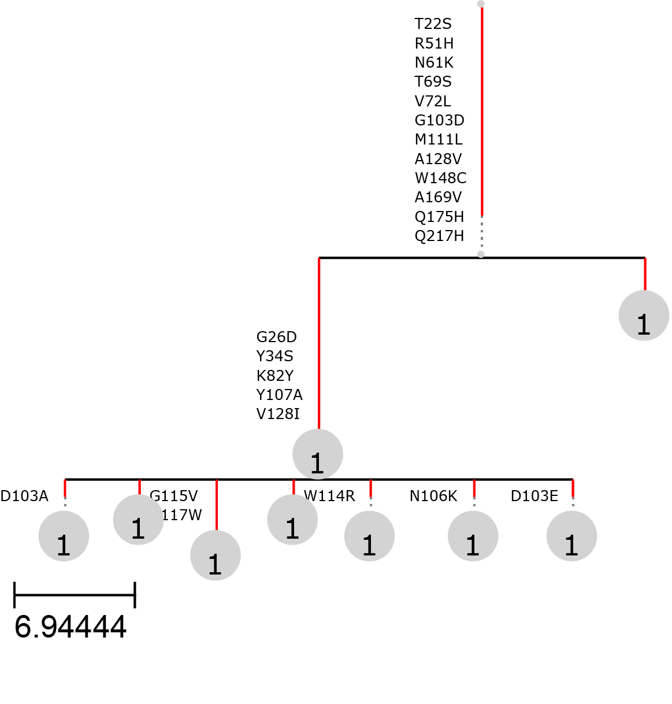

```{r, echo=FALSE}
options(rmarkdown.html_vignette.check_title = FALSE)
```

## Background and relevance of BCR phylogenies

The generation of diversity in B cell receptors (BCRs) is a cornerstone of the adaptive immune system. Through mechanisms such as V(D)J recombination and somatic hypermutation (SHM), B cells are able to produce a vast repertoire of antigen-specific receptors. This process is most active in germinal centers (GCs), transient microanatomical structures within secondary lymphoid organs where B cells undergo rapid proliferation, affinity maturation, and selection.

In the context of **B cell neoplasms**—such as **follicular lymphoma (FL)**, **diffuse large B-cell lymphoma (DLBCL)**, and **chronic lymphocytic leukemia (CLL)**—tumor clones often originate from B cells that have undergone GC-like processes. These malignant cells retain the molecular machinery for SHM and continue to diversify and evolve, sometimes in response to microenvironmental pressures or therapy.

**Phylogenetic analysis of BCR sequences** provides a powerful framework for dissecting the **subclonal architecture and evolutionary trajectories** of these tumors. By reconstructing lineage trees from BCR data, researchers can track how individual subclones emerge, expand, and adapt over time. This is particularly valuable for identifying early founder clones, tracing pathways of clonal selection, and detecting convergent evolutionary patterns.

In addition, the integration of BCR phylogenetic trees with transcriptomic data—such as cell state annotations or expression clusters—can reveal valuable information about the trajectories of transcriptomically distinct subpopulations within a tumor. This multi-layered approach enables the simultaneous tracking of both clonal lineage and functional phenotype, offering deeper insight into the mechanisms of tumor progression and plasticity.

## Reconstructing BCR phylogenetic trees from IgScan outputs

The current version of IgScan supports the possibility to build phylogenetic trees from IgScan outputs using two different bioinformatic methods: ***Dowser*** and ***gctree***.

For both alternatives, we will take as input the data of a single cell object with IgScan annotation in its metadata.

```{r read_seurat, message=FALSE, warning=FALSE, tidy=FALSE}
library(IgScan)
library(dowser)

s <- system.file("extdata/igscan_test_10xSeurat_IgScan_sample4.rds", 
                 package = "IgScan", mustWork = T)

so <- readRDS(s)
```

### Using the *Dowser* package (from the Immcantation workflow)

The input for *Dowser* is an AIRR formatted file that contains the information for the different sequences present in the dataset. In order to retrieve an AIRR file from our Seurat object, we will use the `export_AIRR_format()` function from IgScan.

```{r export_airr, message=FALSE, warning=FALSE, tidy=FALSE}
airr <- export_AIRR_format(object = so, 
                           dir = "~/Desktop/PhyloDowserTest/", ## Change to your path!
                           fileName = "Sample4_AIRR.tsv", 
                           germline_aln = "consensus", 
                           sample_col = "orig.ident", 
                           metadata = c("igSubcloneID_in_Clonotype_num"))
```

Now this exported AIRR file can be use as input for *dowser* with paired heavy and light chain information.

```{r dowser_clones, message=FALSE, warning=FALSE, tidy=FALSE}

## We run this step to generate the columns expected by dowser in the following steps, 
## but IgScan already accounts for this in its workflow.
airr <- resolveLightChains(airr)

## Format airr file into Immcantation clones format
clones <- formatClones(airr,
                       chain="HL", ## specify that the analysis is paired heavy/light
                       nproc=1, 
                       collapse = TRUE, ## to remove duplicated sequences (keep count)
                       split_light = TRUE, 
                       minseq = 3, 
                       germ = "germline_alignment", ## custom germline sequence
                       traits = "igSubcloneID_in_Clonotype_num") ## metadata to include
```

Once the sequences have been formatted, we can use the `clones` object to build BCR phylogenies. The *dowser* framework supports multiple modes for phylogenetic inference. In this vingette, we will use the default mode (*parsimony ratchet* or *pratchet*), but you can learn how to use more complex phylogenetic models in the [*dowser* website](https://dowser.readthedocs.io/en/latest/).

```{r dowser_phylo, message=FALSE, warning=FALSE, tidy=FALSE, fig.height=4, fig.width=7}
clones <- getTrees(clones)

plots <- plotTrees(clones,
                   tipsize="collapse_count", # tip size based on abundance
                   tips = "igSubcloneID_in_Clonotype_num") ## tip color based on metadata

plots[[1]]
```

As you can see in the plot above, we have produced BCR-based phylogenetic trees for all the clones with at least three different nucleotide sequences (`minseq = 3`). This has left us with one tree, for the dominant clonotype in the sample (C1).

Of interest, we have been able to set the size of the tips proportional to the abundance of each subclone, which are represented by the different tip colors.

### Using the *gctree* package

The input for *gctree* is a directory containing several files needed for running the program. In order to generate these required input files, IgScan provides the function `IgScan::prepare_gctree_input()`, which can take any IgScan annotated object (both bulk data frames or single cell objects) and writes all the specified inputs in the specified `outDir`.

```{r prep_gctree, message=FALSE, warning=FALSE, tidy=FALSE}
prepare_gctree_input(object = so, 
                     outDir = "~/Desktop/PhyloGCTreeTest/", ## Change to your path! 
                     mode = "single_cell", 
                     cloneID = "C1", ## build phylogenies for C1
                     chain = "HL") ## paired heavy and light chain
```

Now that we have generated the required *gctree* input files, we need to run several commands inside the `outDir` to perform the phylogenetic inference.

**NOTE:** To install *gctree* you can follow the instructions on the [*gctree* website](https://matsen.group/gctree/install.html). Then once installed, you should activate the conda environment or whatever needed to run the *gctree* commands.

```{bash, eval=FALSE}

## Change working directory to the outDir
cd 'outDir'

## Write config file
mkconfig deduplicated.phylip dnapars > dnapars.cfg

## Run parsimony tree inference
dnapars < dnapars.cfg > dnapars.log

## Use abundance data to recalculate trees
gctree infer outfile abundances.csv --root GL --frame 1 --verbose
```

After running the commands above, the following phylogenetic tree of C1 is generated in the `outDir` directory.

```{r, out.width="80%", out.height="80%", echo=FALSE}

```

It can be observed that the topology of the trees generated by *dowser* and *gctree* are identical, with a main clade that groups the vast majority of subclones and a less mutated subclone that diverges earlier in the phylogeny (right part of the tree). For more detailed downstream analyses with *gctree* you can explore the [*gctree* website](https://matsen.group/gctree/index.html).
