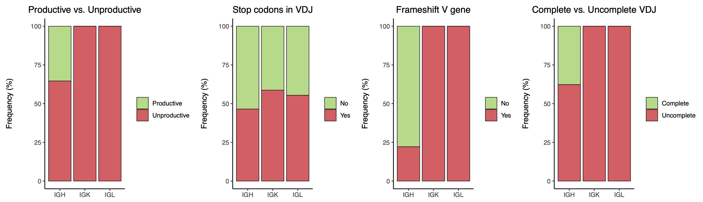
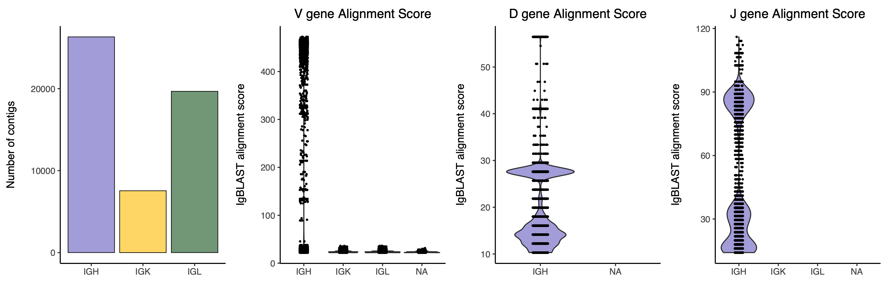
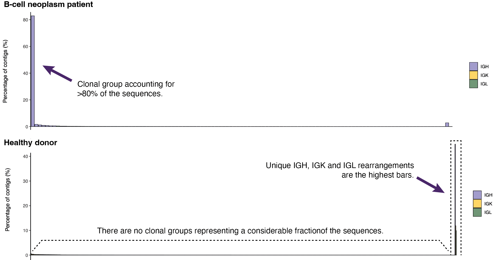

As mentioned in previous vignettes, IgScan workflows allow the user to generate a detailed **report file** of the sequence re-annotation step using the IgBlast tool. This report can help the user to understand key aspects of the data that are needed to properly adjust the parameters for the following IgScan steps, such as the level of repertoire diversity or the quality of the alignment process.

We recommend generating and reviewing this report before running further IgScan functuions, especially when working with **novel datasets**, **tumor samples with unknown purity** or **healthy samples**.

To explain how to interpret this report, we will follow an example of a tumoral sample analyzed by IGH-NGS plot by plot.

### Sequence completeness and productiveness

The first panel in the IgBlast report shows the proportion of Productive/Unproductive sequences, as well as the percentage of sequences with stop codons, frameshift V gene or incomplete VDJ.

```{r, out.width="100%", echo=FALSE, fig.path = "images/"}

```

In this example, we observe that approximately 35% of the sequences in the IGH *locus* are productive, while the remaining 65% are primarily incomplete VDJ rearrangements. Notably, IgBlast appears to have mapped some sequences to the IGK and IGL *loci*, which should not occur, given that the sample was derived from an IGH-targeted amplification assay. However, all the light-chain (IGK/IGL) sequences are unproductive. The next section of the report provides further insights into these unexpected alignments.

### IgBlast alignment scores

This section of the report presents the absolute number of contigs mapped to each *locus*, along with the alignment scores for the V, D, J, and C genes (when present in the data) per *locus*.

```{r, out.width="100%", echo=FALSE, fig.path = "images/"}

```

It is notable that the IGH *locus* contains the highest number of contigs. Additionally, the V gene alignment scores for IGH are substantially higher compared to those for IGK and IGL, where the V gene scores are close to zero. This suggests that all IGK/IGL mappings are likely low-quality alignments and should be removed from the dataset. These results highlight the importance of setting an appropriate E-value cutoff when running IgBlast—a user-defined parameter in IgScan—to filter out low-confidence alignments.

### Determining sample BCR clonality

When running IgScan, it is important to assess the level of BCR clonality of the samples analyzed. This is because certain steps in the IgScan workflow can require significantly longer execution times when using default parameters in highly polyclonal samples. In this context, the IgBlast report file provides valuable information about BCR clonality, which can help anticipate potential computational demands and guide parameter adjustments accordingly.

```{r, out.width="100%", echo=FALSE, fig.path = "images/"}

```

In this example, the *Distribution of Clonal Rearrangements* plot is shown for a sample derived from a B-cell neoplasm patient and for a sample from a healthy donor. Remarkably, the tumor sample exhibits a dominant clonal group—defined as a unique combination of V gene and amino acid CDR3 sequence—representing more than 80% of the total sequences. In contrast, the healthy donor sample does not contain any clonal group exceeding 1% frequency, and more than 50% of the sequences are singletons (unique sequences observed only once).

These contrasting clonality profiles warrant different settings for the `cdr3_InDel_correction_mode` parameter in the next IgScan function:

-   **Tumor sample:** `cdr3_InDel_correction_mode="hard_filter"` in single cell data and `cdr3_InDel_correction_mode="soft_filter"` in bulk NGS data.

-   **Healthy donor sample:** `cdr3_InDel_correction_mode="no"` .

**Note:** Along with the IgBlast report PDF file, a report TXT file is also generated. This file contains the correspondence between each "clonal group ID" displayed in the barplot and its associated `Vgene_CDR3aa` sequence. The content of this file typically looks like the following:

Dictionary of the corresponding IGVgene_CDR3aa for each clonal group:

IGK.1 --\> IGKV1D-12_QQANSFPPT

IGH.1 --\> IGHV1-3_ARLLHGAYYYYYYGMDV

IGK.2 --\> IGKV4-1_QQYYSTPWT

....
